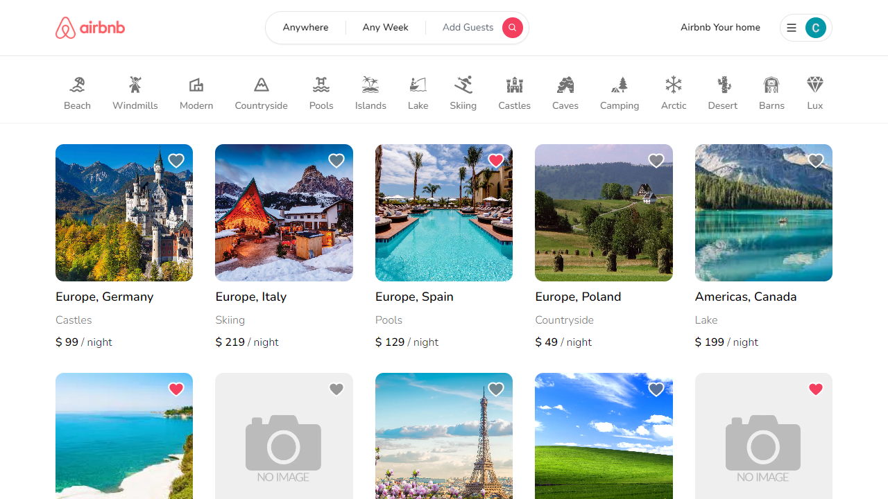
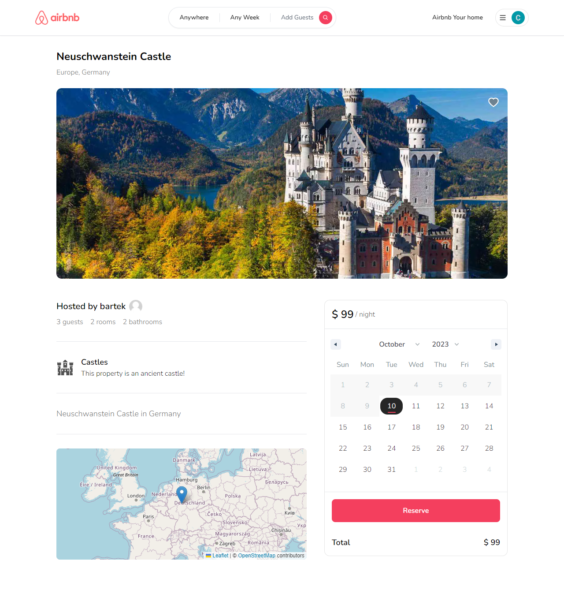

# Full Stack Airbnb Clone with Next.js 13.4

Features:

- Tailwind design, RWD
- Authentication (Credentials, Google, Github)
- Image upload using Cloudinary CDN
- Booking / Reservation system
- Booking and cancellation
- Adding to favorites
- Loading states
- Ability to share links
- Pricing calculation
- Filtering properties
- GET, POST and DELETE routes

##  [Visit project url](https://next13-airbnb-inky.vercel.app/)

  

  

